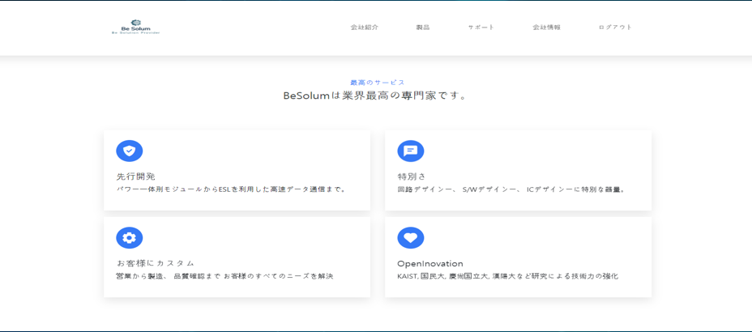

# BeSolum [MDB]
### 가상 SI 전문 업체 WebSite Development

## 프로젝트 로직

## 프로젝트 요약
 
> 2023.02.01 - 2023.03.08   
 
> **팀 웹 프로젝트**
* 프론트엔드1, 백엔드1로 구성되어 있는 2인 팀 프로젝트입니다.
* bootstrap framework를 사용하여 프론트엔드 웹 화면을 구성
* XAMPP + PHP를 활용하여 사용자 등록 및 CRUD 게시판 생성
* SI 업체에서 흔히 쓰이는 UI를 참조하여 구성
 

## 느낀점
* php기반의 Laravel framework를 활용하여 CRUD를 구성하여 짰으면 프로젝트 소요 시간을 1주일 가량 줄일 수 있었음
* SI업체 주로 쓰이는 백그라운 컬러 중에 남색, 내용 역시 텍스트 위주로 구성하다 보니 다소 지루한 감이 있음
* XAMPP(가상 서버)를 사용하지 않으면 웹사이트 자체가 동작하지 않기에 웹 서버에 대한 공부가 필요하다는 것을 느낌
* 포트폴리오 제출 기간이 1개월 가량 밖에 주어지지 않다 보니 최대한 간단한 것을 선택해야 해서 추가적인 기능을 넣을 여유가 없었음
 

## 시연영상
https://www.youtube.com/watch?v=Ic5wCxeiFbE

